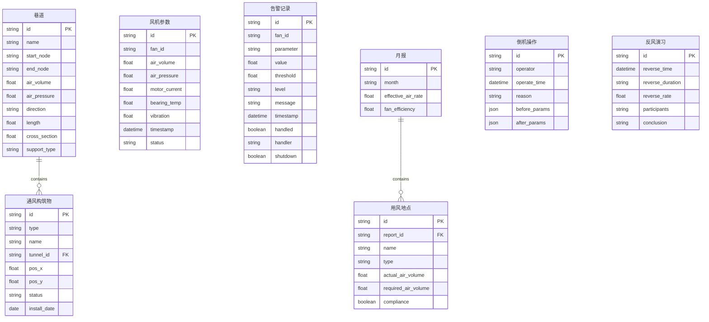

## 1. 架构设计

```mermaid
graph TB
    subgraph "前端层"
        "React 18 + Vite" --> "Ant Design 5"
        "React 18 + Vite" --> "ECharts 5"
        "React 18 + Vite" --> "React Router 6"
    end
    subgraph "模拟数据层"
        "Mock Data Service" --> "模拟风机参数"
        "Mock Data Service" --> "模拟告警数据"
        "Mock Data Service" --> "模拟月报数据"
        "Mock Data Service" --> "模拟倒机/反风记录"
    end
    subgraph "数据存储(模拟)"
        "PostgreSQL Schema" --> "设备参数表"
        "PostgreSQL Schema" --> "告警记录表"
        "PostgreSQL Schema" --> "月报数据表"
        "PostgreSQL Schema" --> "倒机操作表"
        "PostgreSQL Schema" --> "反风演习表"
    end
    "前端层" --> "模拟数据层"
    "模拟数据层" --> "数据存储(模拟)"
```

## 2. 技术说明

- 前端：React@18 + Ant Design@5 + ECharts@5 + Vite
- 初始化工具：Vite (vite-init)
- 后端：无独立后端，使用前端模拟数据服务
- 数据库：PostgreSQL Schema设计，数据通过前端Mock模拟生成
- 路由：React Router@6
- PDF导出：html2canvas + jsPDF
- 状态管理：React Context + useReducer

## 3. 路由定义

| 路由 | 用途 |
|------|------|
| / | 重定向至 /ventilation-map |
| /ventilation-map | 通风系统网络图 |
| /fan-monitor | 主通风机实时监控 |
| /monthly-report | 通风月报 |
| /operation-records | 倒机操作与反风演习记录 |

## 4. API定义（模拟）

### 4.1 通风系统图数据

```typescript
interface Tunnel {
  id: string;
  name: string;
  startNode: string;
  endNode: string;
  airVolume: number;       // m³/s
  airPressure: number;     // Pa
  direction: 'in' | 'out';
  length: number;          // m
  crossSection: number;    // m²
  supportType: string;
}

interface VentilationStructure {
  id: string;
  type: 'air_door' | 'air_window' | 'air_wall' | 'air_bridge';
  name: string;
  tunnelId: string;
  position: { x: number; y: number };
  status: 'normal' | 'abnormal';
  installDate: string;
}
```

### 4.2 风机实时参数

```typescript
interface FanParameters {
  fanId: string;
  airVolume: number;       // m³/s
  airPressure: number;     // Pa
  motorCurrent: number;    // A
  bearingTemp: number;     // °C
  vibration: number;       // mm/s
  timestamp: string;
  status: 'normal' | 'warning' | 'alarm';
}
```

### 4.3 告警记录

```typescript
interface AlarmRecord {
  id: string;
  fanId: string;
  parameter: string;
  value: number;
  threshold: number;
  level: 'warning' | 'alarm';
  message: string;
  timestamp: string;
  handled: boolean;
  handler?: string;
  shutdown?: boolean;
}
```

### 4.4 月报数据

```typescript
interface MonthlyReport {
  month: string;
  locations: AirLocation[];
  effectiveAirRate: number;
  fanEfficiency: number;
}

interface AirLocation {
  name: string;
  type: '采煤工作面' | '掘进面' | '硐室';
  actualAirVolume: number;
  requiredAirVolume: number;
  compliance: boolean;
}
```

### 4.5 倒机操作记录

```typescript
interface FanSwitchRecord {
  id: string;
  operator: string;
  operateTime: string;
  reason: '计划检修' | '故障切换';
  beforeParams: FanParameters;
  afterParams: FanParameters;
}

interface ReverseAirDrill {
  id: string;
  reverseTime: string;
  reverseDuration: string;
  reverseRate: number;
  participants: string[];
  conclusion: string;
}
```

## 5. 数据模型

### 5.1 数据模型定义



### 6.2 数据定义语言（模拟，不实际创建数据库）

```sql
CREATE TABLE tunnels (
    id VARCHAR(36) PRIMARY KEY,
    name VARCHAR(100) NOT NULL,
    start_node VARCHAR(50) NOT NULL,
    end_node VARCHAR(50) NOT NULL,
    air_volume FLOAT DEFAULT 0,
    air_pressure FLOAT DEFAULT 0,
    direction VARCHAR(10) DEFAULT 'in',
    length FLOAT DEFAULT 0,
    cross_section FLOAT DEFAULT 0,
    support_type VARCHAR(50)
);

CREATE TABLE ventilation_structures (
    id VARCHAR(36) PRIMARY KEY,
    type VARCHAR(20) NOT NULL,
    name VARCHAR(100) NOT NULL,
    tunnel_id VARCHAR(36) REFERENCES tunnels(id),
    pos_x FLOAT DEFAULT 0,
    pos_y FLOAT DEFAULT 0,
    status VARCHAR(20) DEFAULT 'normal',
    install_date DATE
);

CREATE TABLE fan_parameters (
    id VARCHAR(36) PRIMARY KEY,
    fan_id VARCHAR(50) NOT NULL,
    air_volume FLOAT,
    air_pressure FLOAT,
    motor_current FLOAT,
    bearing_temp FLOAT,
    vibration FLOAT,
    timestamp TIMESTAMP DEFAULT NOW(),
    status VARCHAR(20) DEFAULT 'normal'
);

CREATE TABLE alarm_records (
    id VARCHAR(36) PRIMARY KEY,
    fan_id VARCHAR(50) NOT NULL,
    parameter VARCHAR(50),
    value FLOAT,
    threshold FLOAT,
    level VARCHAR(10) NOT NULL,
    message TEXT,
    timestamp TIMESTAMP DEFAULT NOW(),
    handled BOOLEAN DEFAULT FALSE,
    handler VARCHAR(50),
    shutdown BOOLEAN DEFAULT FALSE
);

CREATE TABLE monthly_reports (
    id VARCHAR(36) PRIMARY KEY,
    month VARCHAR(7) NOT NULL,
    effective_air_rate FLOAT,
    fan_efficiency FLOAT
);

CREATE TABLE air_locations (
    id VARCHAR(36) PRIMARY KEY,
    report_id VARCHAR(36) REFERENCES monthly_reports(id),
    name VARCHAR(100),
    type VARCHAR(50),
    actual_air_volume FLOAT,
    required_air_volume FLOAT,
    compliance BOOLEAN
);

CREATE TABLE fan_switch_records (
    id VARCHAR(36) PRIMARY KEY,
    operator VARCHAR(50) NOT NULL,
    operate_time TIMESTAMP NOT NULL,
    reason VARCHAR(20) NOT NULL,
    before_params JSONB,
    after_params JSONB
);

CREATE TABLE reverse_air_drills (
    id VARCHAR(36) PRIMARY KEY,
    reverse_time TIMESTAMP NOT NULL,
    reverse_duration VARCHAR(50),
    reverse_rate FLOAT,
    participants TEXT,
    conclusion TEXT
);

CREATE INDEX idx_alarm_fan ON alarm_records(fan_id);
CREATE INDEX idx_alarm_timestamp ON alarm_records(timestamp);
CREATE INDEX idx_alarm_level ON alarm_records(level);
CREATE INDEX idx_fan_params_timestamp ON fan_parameters(timestamp);
